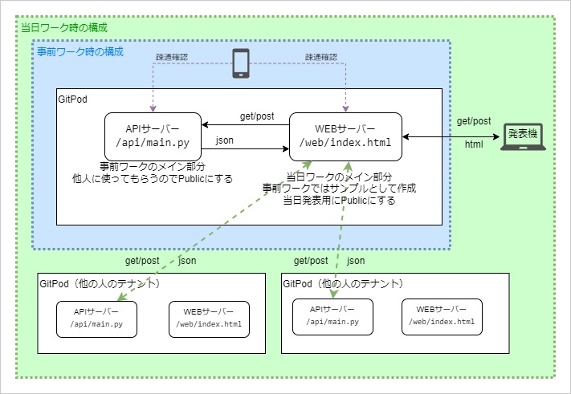

# APIPracticeProject01
202309勉強会用パブリックリポジトリ

## 簡易構成図



## 1. 初回起動リンク
GitHub上から、下記リンクでIDEに遷移する  
→ [open in gitpod](https://gitpod.io/#github.com/will121173/APIPracticeProject01)

※2回目以降、自身のファイルを再度開く場合は、[Workspaces](https://gitpod.io/workspaces)  から。  


## 2. サンプル作成・デプロイ
（ここからはGitPod上で操作する）

TERMINALタブで以下を実行する
- APIのホスト用コマンド
- Webページのホスト用コマンド
- 外部からのアクセス許可
- src/web/index.htmlの1行をコメントを元に修正
- src/web/sampleJS.jsの1行をコメントを元に修正


### APIのホスト用コマンド
`uvicorn main:app --reload --port 3000`  

※main.pyのあるディレクトリで実行
```
例:
cd src/api/
uvicorn main:app --reload --port 3000
```

### Webページのホスト用コマンド
`python -m http.server 8000`  

※index.htmlのあるディレクトリで実行  
※APIのホスト用コマンドとは別のTerminalで実行  
　（ターミナル追加ボタン・画像参照）

```
例:
cd src/web/
python -m http.server 8000
```


### 外部からのアクセス許可
下部ウィンドウのPORTSタブ > port3000の行をpublic(鍵が空いている状態)にする  
下部ウィンドウのPORTSタブ > port8000の行をpublic(鍵が空いている状態)にする  


## 3. 接続テスト①
PORTSタブのport番号8000の行にあるURLへアクセス、サンプルページがうまく表示できればOK 

## 4. 接続テスト②
1. PORTSタブのport番号8000の行にあるURLへ「スマホ等別ネットワークの機器」からアクセス、サンプルページがうまく表示できる  
2. PORTSタブのport番号8000の行にあるURLへ「スマホ等別ネットワークの機器」からアクセス、サンプルページがうまく表示できる  

接続テスト②までOKなら当日ワークの準備もOK！後は自由に制作してください


## 5. 保存
変更は自動で保存され、[Workspaces](https://gitpod.io/workspaces)  から再度開けます。  
ただし、GitPodのワークスペースは2週間以上操作しないと消えてしまいますので
念のため下記Zip化コマンドを使用してバックアップしてください。

### Zip化コマンド:  
`zip -r project.zip /workspace/APIPracticeProject01`  
カレントディレクトリにZipで全体が保存される。プロジェクト名を変えている場合はパスが変わるので注意  
→ ファイル右クリックからダウンロード

## 6. ドキュメント
当日ワークでは作成したAPIを他の人に使ってもらいます。ドキュメントを作りましょう。
1. 自動生成：  
APIサーバーを起動した状態で、(APIサーバーのURL)/docsと入力すると自動生成された解説ページを開ける。  
入力パラメータ等のテストも可能。
また、api/main.py中に特定の方法で書いてあるdescriptionが反映される。

2. あえてFastAPIを使わず自力で実装したなど、自動生成されたドキュメントがない場合は、他の人がソースを見なくても使えるように解説を書いておいてください。

