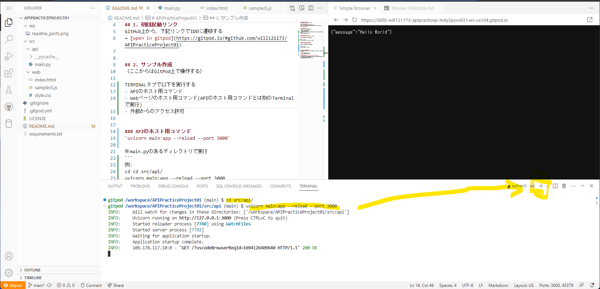

# APIPracticeProject01
202309勉強会用パブリックリポジトリ

## 1. 初回起動リンク
GitHub上から、下記リンクでIDEに遷移する  
→ [open in gitpod](https://gitpod.io/#github.com/will121173/APIPracticeProject01)


## 2. サンプル作成
（ここからはGitPod上で操作する）

TERMINALタブで以下を実行する
- APIのホスト用コマンド
- Webページのホスト用コマンド
- 外部からのアクセス許可
- src/web/index.htmlの1行をコメントを元に修正
- src/web/sampleJS.jsの1行をコメントを元に修正


### APIのホスト用コマンド
`uvicorn main:app --reload --port 3000`  

※main.pyのあるディレクトリで実行
```
例:
cd cd src/api/
uvicorn main:app --reload --port 3000
```

### Webページのホスト用コマンド
`python -m http.server 8000`  

※index.htmlのあるディレクトリで実行  
※APIのホスト用コマンドとは別のTerminalで実行

```
例:
cd cd src/web/
 python -m http.server 8000
```




### 外部からのアクセス許可
下部ウィンドウのPORTSタブ > port3000の行をpublic(鍵が空いている状態)にする  


※画像の行はPort番号が違います


## 3. 接続テスト
PORTSタブのport番号8000の行にあるURLへアクセス、サンプルページがうまく表示できればOK！  
後は自由に開発してください。

## 4. その他
GitPodのワークスペースは2週間以上操作しないと消えてしまいます。
念のため下記Zip化コマンドを使用してバックアップしてください。

### Zip化コマンド:  
`zip -r project.zip /workspace/APIPracticeProject01`  
カレントディレクトリにZipで全体が保存される。プロジェクト名を変えている場合はパスが変わるので注意  
→ ファイル右クリックからダウンロード
