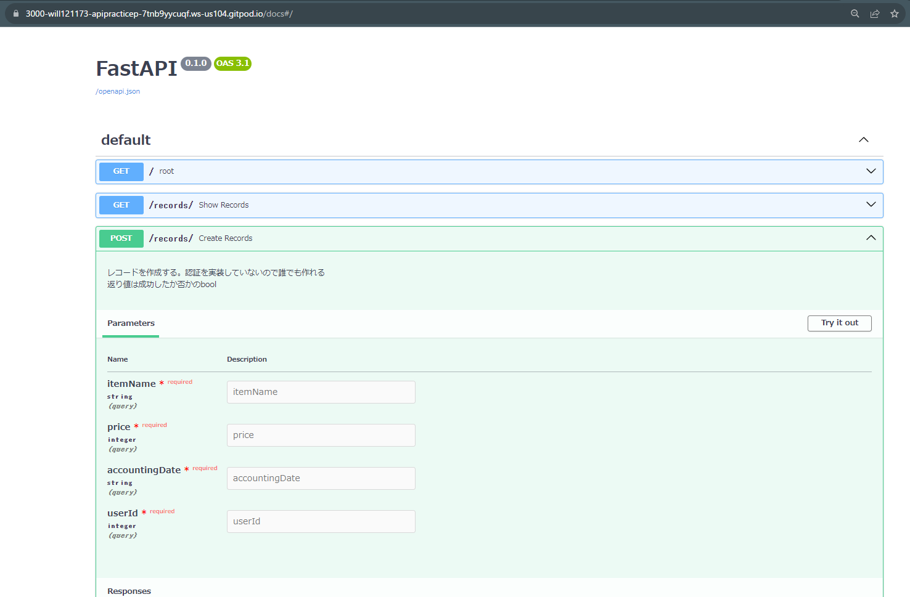
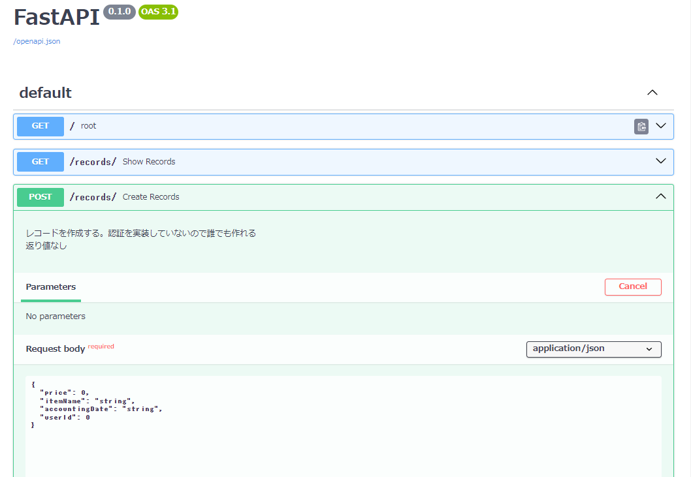

# api_sample2のreadme

はじめにあったサンプルは、ほぼアプリの実態を作らないサンプルだったので、APIの存在意義が分かりにくかったかもしれません。

APIには例えば以下の分類があって、
- 情報を得るためのもの：郵便番号から住所を検索するAPI、翻訳API　←　1つ目のサンプルはこちらのイメージ
- アプリを操作するための：クラウド家計簿ソフトを操作するAPI　← 本サンプルで扱います

当然、操作する対象のアプリを作成する必要があるのですが、なるべく簡単に最低限の家計簿アプリを作成していきます。


## 要件
- オンライン上に買ったものを記録できる
- 複数ユーザーで使用できる
- ひとまず認証はナシ（！）

## 簡易クラス図
簡単にだけクラス図を作成します。


ちなみに、クラス図はこちらのサービスで書きました↓  
https://app.diagrams.net/


## 1. DBを作る
なるべく簡単にできるように、SQLiteを使用します。

DB作成のために、1度だけ実行するスクリプトを用意します。 > `initialize.py` 参照

```
cd /workspace/APIPracticeProject01/src/api_sample2
/home/gitpod/.pyenv/shims/python /workspace/APIPracticeProject01/src/api_sample2/initialize.py
```
※APIホスト時とパスを揃えるためcd必須、パスが異なる場合は適宜修正

これでDB本体の作成が完了です！  
なお、覚える知識が少なく済むようにPython側でテーブルをクラス・データモデルとしては作らず適宜値を入れる形式にしています。  
もしそのあたりもちゃんと作る場合はPydanticライブラリが役に立ちます。

## 2. APIのメソッド部分を作る
ユーザーIDを指定して全レコードを取得する機能と、レコードを追加する機能を作成しました。 > `main.py` 参照

ユーザー操作APIを作っていないのですが、DB作成時にid=1,2だけサンプルとして作成しているのでそれを使用します。

## 3. APIのホスト
コマンド時のパスだけ今回のサンプル用にします

※main.pyのあるディレクトリで実行
```
例:
cd src/api_sample2/
uvicorn main:app --reload --port 3000
```

他はルートにあるreadmeのサンプルと同じです。

## 4. 利用側、フロントエンドの作成

フロントエンドは当日、**他の人に作ってもらう**内容ですが、動作確認のために可能な限り自分でも作成してください。

利用者になって気持ちでドキュメントにアクセスします。  
APIをホストした状態で {URL}/docsへ移動します。  


利用できるURLの一覧と説明を見ることができます。  
Try it out ボタンを押すと実際に実行することもできるのでやってみましょう。  

> postでデータ登録（json形式で書いてExecute）
  

> getで確認
  

だいたい使い方がわかったら、フロントエンドを作成します。  
手順ではAPIは全世界に公開しているので、フロントエンド側はローカルのHTMLにベタ書きでも動くのですが、  
せっかくなのでこちらも公開できるようにします。  
> ※機密情報はアプリ内に書かないでください。

`src/web_sample2`にサンプルアプリを作成しました。

`sample2JS.js`の1行のみ、自身の環境用に書き換える必要があります。


## 5. Webページのホスト
コマンド時のパスだけ今回のサンプル用にします
```
例:
cd src/web_sample2/
python -m http.server 8000
```
他はルートにあるreadmeのサンプルと同じです。


> 家計簿として使えなくもないアプリができました。  
見た目は微妙ですが、API経由で動かしているので、クライアントアプリは自由に作ることができます。


### あとがき

似た構造で、ToDoアプリ、掲示板アプリなども作ることができます。  
当日はグループワークで他の人にAPIを使ってもらう予定なので、ぜひ使い道がわかりやすいAPIを意識してみてください。
